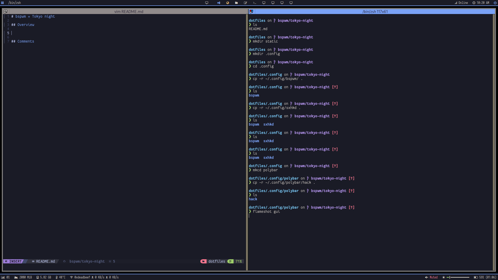
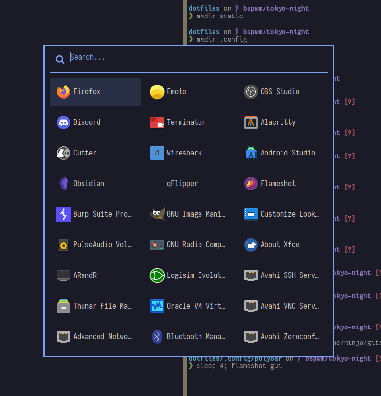
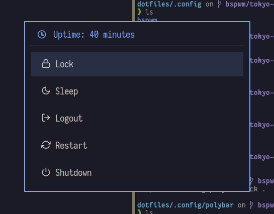

# bspwm + Tokyo night

## Setup

* Terminator
* Rofi
* Zsh with starship prompt

## Overview

## Comments

I need to setup my double screen config and tweak some style/GTK but for now it is good.
