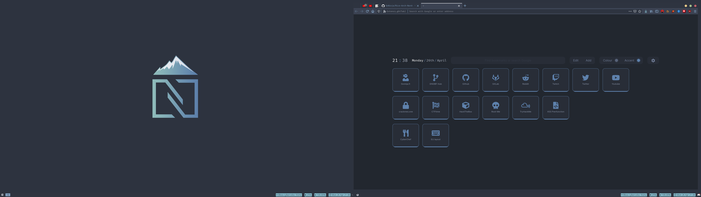
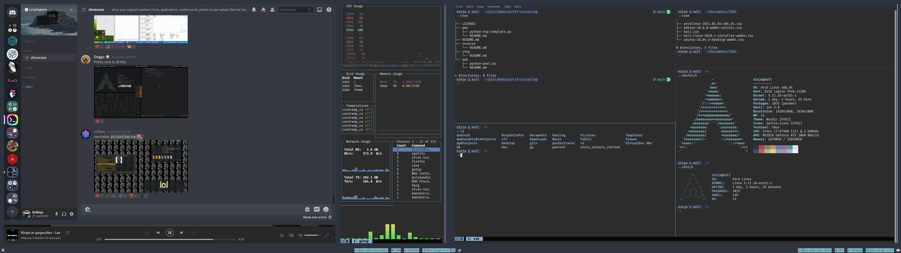
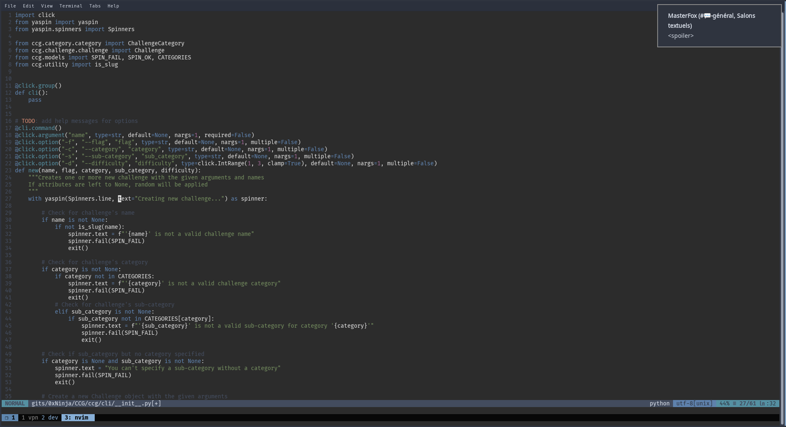

# Rice-Arch-Nord

My dotfiles and stuff for an Arch Linux rice, with a Nord theme

---

## Details

* Distro: Archlinux
* WM: i3-gaps
* Wallpaper: [Nord wallpaper](https://vsthemes.org/uploads/posts/2020-04/1586853730_nord-peeks.png)
* Font: Fira Code
* Terminal: xfce-terminal
* Bar: i3-bar

