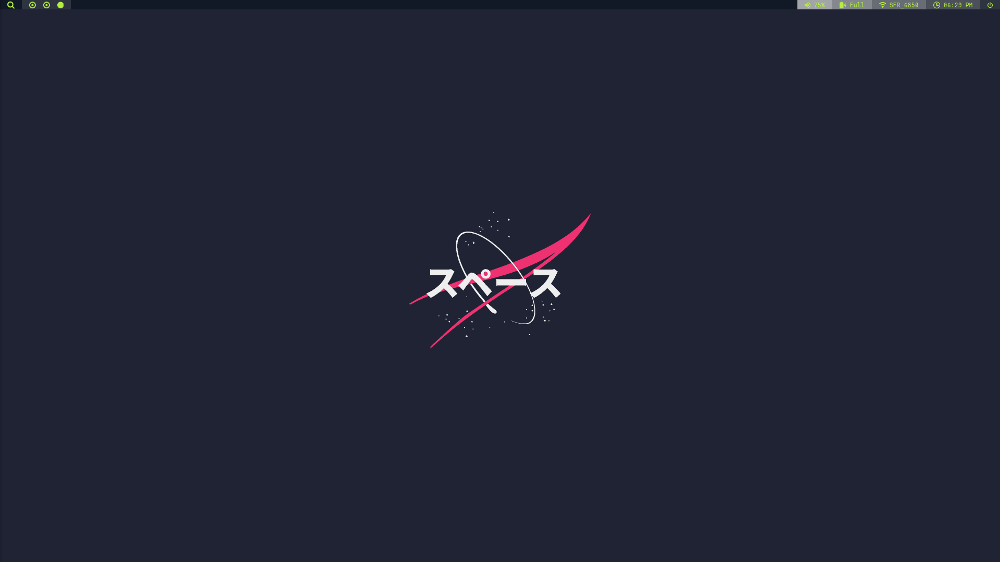
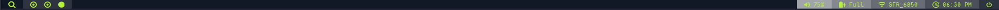
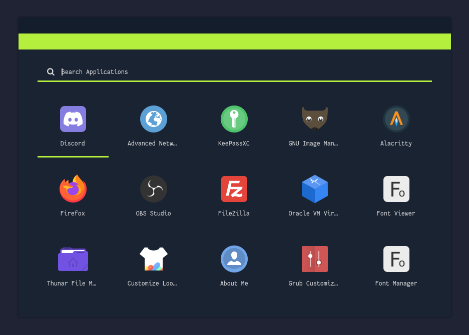
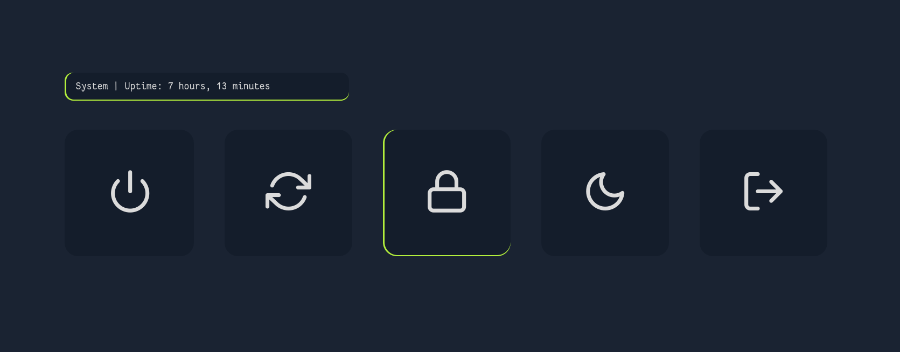
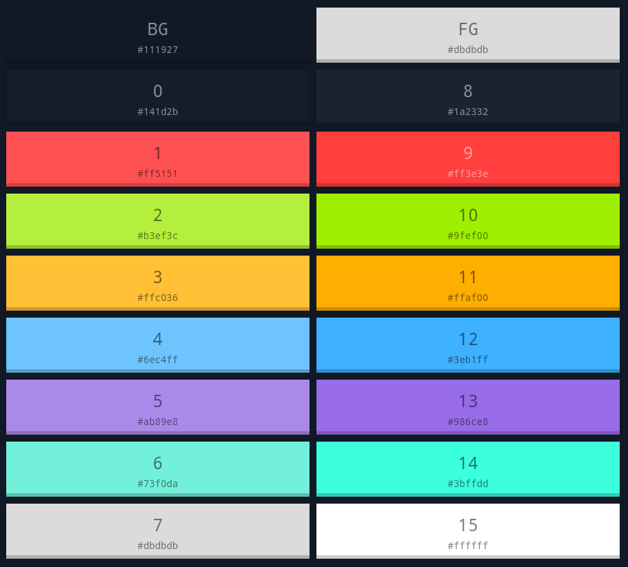
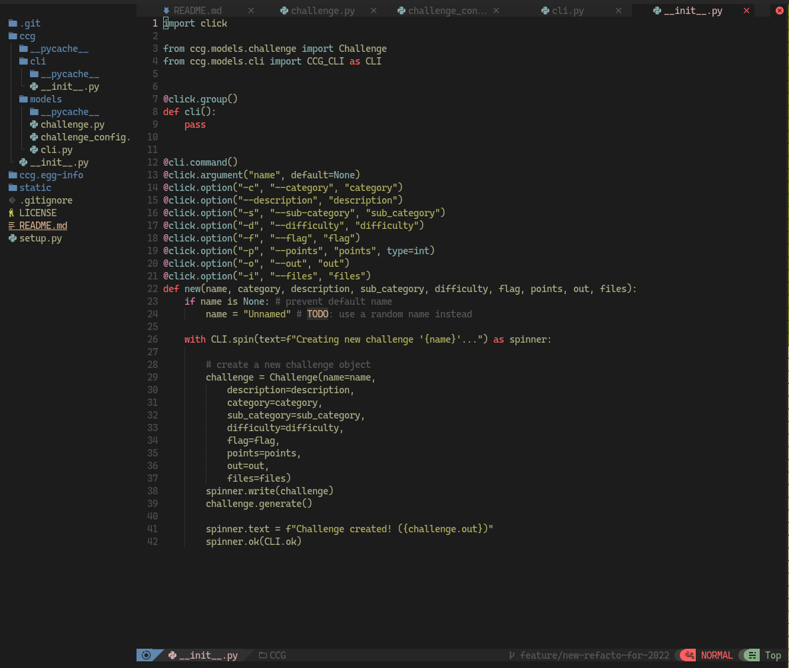
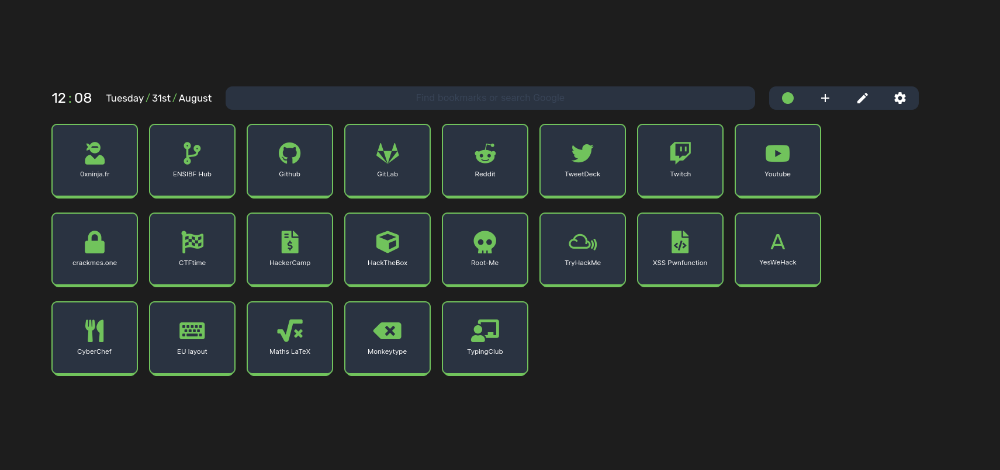
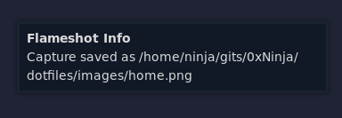
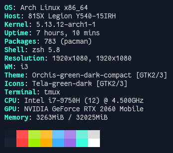

# Dotfiles

My current dotfiles, will try to update if I change my theme

## Overview

<details>
<summary>Home and bar</summary>




</details>

<details>
<summary>Rofi</summary>




</details>

<details>
<summary>Colors</summary>



</details>

<details>
<summary>nvim</summary>



</details>

<details>
<summary>Other</summary>

Firefox [NightTab](https://github.com/zombieFox/nightTab)



Dunst notifier





Grub


</details>

## Packages & tweaks

<details>
<summary>zsh</summary>

I use the [spaceship prompt](https://github.com/spaceship-prompt/spaceship-prompt). Vanilla.

</details>

<details>
<summary>tmux</summary>

[.tmux](https://github.com/gpakosz/.tmux) with some color changes and refined for more simplicity.

</details>

<details>
<summary>Rofi</summary>

I use this [rofi collection](https://github.com/adi1090x/rofi) (launcher style 1, powermenu style fullscreen) with a custom `theme.rasi`.

</details>

<details>
<summary>Grub theme</summary>

[Matter grub theme](https://github.com/mateosss/matter) works pretty well, tweaked the colors and my entries.

```css
# /boot/grub/themes/Matter/theme.txt

# Global Property
title-text: ""
# desktop-image: "background.png"
desktop-color: "#111927"
terminal-font: "Unifont Regular 16" # A smaller font for the console
terminal-box: "terminal_box_*.png"
terminal-left: "0"
terminal-top: "0"
terminal-width: "100%"
terminal-height: "100%"
terminal-border: "0"

# Show the boot menu
+ boot_menu {
  left = 36%
  top = 29%
  width = 28%
  height = 60%
  item_font = "Google Sans Regular 32"
  item_color = "#dbdbdb"
  selected_item_color = "#b3ef3c"
  icon_width = 64
  icon_height = 64
  item_height = 64
  item_spacing = 32
  selected_item_pixmap_style = "select_*.png"
}

# Show a countdown message using the label component
+ label {
  top = 80%
  left = 35%
  width = 30%
  align = "center"
  id = "__timeout__"
  text = "Booting in %d seconds"
  color = "#dbdbdb"
  font = "Google Sans Regular 32"
}
```

</details>

## Install

* `./setup.sh`

**OR**

* Use single file for a particular config
