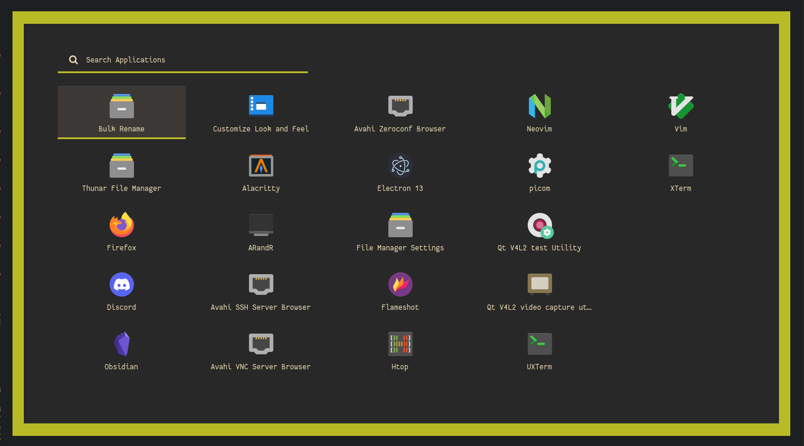

# Dotfiles

My current dotfiles, will try to update if I change my theme

## Overview

Home and bar

Rofi

Colors

nvim

Other

Firefox [NightTab](https://github.com/zombieFox/nightTab)

Dunst notifier

## Packages & tweaks

zsh

I use the [spaceship prompt](https://github.com/spaceship-prompt/spaceship-prompt). Vanilla.

tmux

[.tmux](https://github.com/gpakosz/.tmux) with some color changes and refined for more simplicity.

Rofi

I use this [rofi collection](https://github.com/adi1090x/rofi) (launcher style 1, powermenu style fullscreen) with a custom `theme.rasi`.

## Install

* `./setup.sh`

**OR**

* Use single file for a particular config
