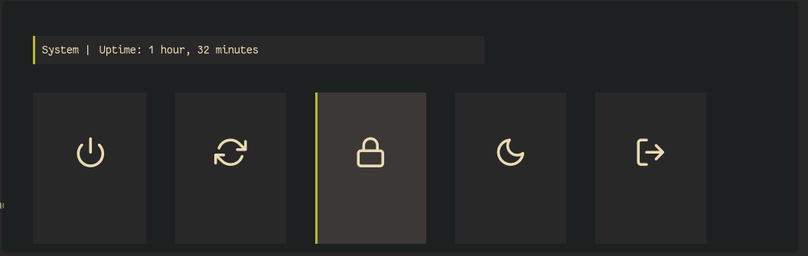
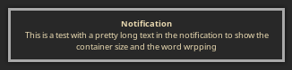

# Dotfiles

My current dotfiles, will try to update if I change my theme

## Overview

Home and bar

Rofi

Colors

nvim

Other

## Install

* `./setup.sh`

**OR**

* Use single file for a particular config
